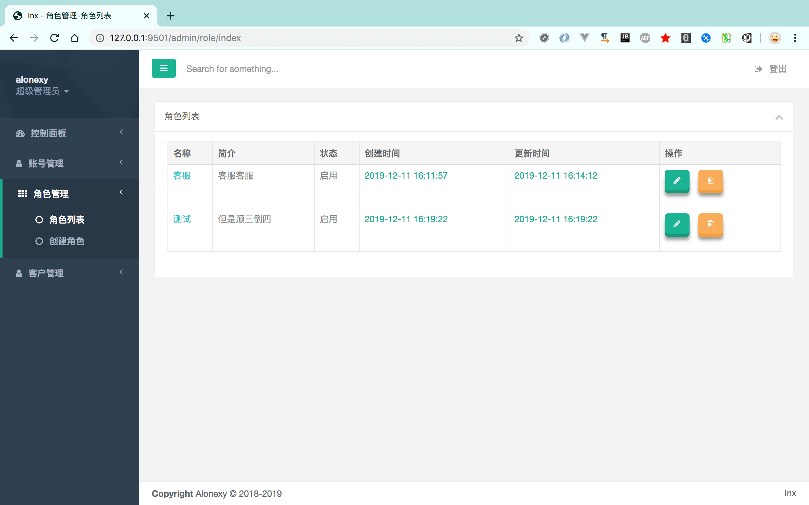
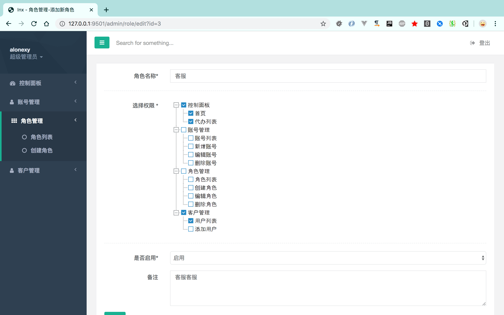

# HF-Admin

实现简单的后台操作

基于 Hyperf v1.1.8

使用INX 模版 基于注解实现 菜单 图标和显示的控制

## HfAdminC
```php
 * @AutoController(prefix="/admin/user",server="http")
 * @HfAdminC(Cname="账号管理",Cstyle="fa-user",Csort=2)
 * @Middleware(HfAdminMiddleWare::class)
 * Class UserController
 * @package App\Controller\Admin
 */
class UserController extends AbstractController{...}
```
## HfAdminF
```php
    /**
     * @HfAdminF(Fname="账号列表",Fdisplay=true,Fstyle="fa-circle-o")
     * @param RequestInterface $request
     * @param RenderInterface $response
     * @return mixed
     */
    public function index(RequestInterface $request, RenderInterface $view){...}
```
## 效果图




# Demo
-  内含短网址服务DEMO
http://d.alonexy.com/
